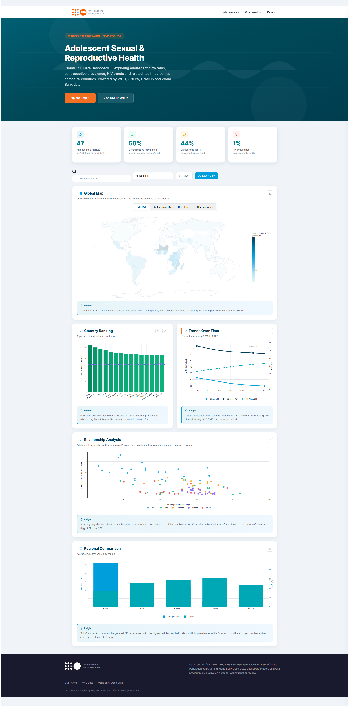

# UNFPA Adolescent SRH Dashboard

[](https://haijunche.github.io/unfpa-cse-dashboard/dashboard.html)
[](https://www.who.int/data/gho)
[](LICENSE)

An interactive data visualization dashboard for monitoring adolescent sexual and reproductive health indicators across countries worldwide. Built with vanilla HTML/CSS/JavaScript — no build tools required.

[View Live Dashboard](https://haijunche.github.io/unfpa-cse-dashboard/dashboard.html)

---

## 📋 Table of Contents

- [Overview](#overview)
- [Live Demo](#live-demo)
- [Features](#features)
- [Data](#data)
- [Tech Stack](#tech-stack--tools)
- [Quick Start](#quick-start)
- [Project Structure](#project-structure)
- [Screenshots](#screenshots)
- [License](#license)

---

## Overview

This dashboard visualizes **75 countries** across **10 key SRH indicators**, including adolescent birth rates, contraceptive prevalence, HIV trends, and comprehensive sexuality education coverage. It is designed as a demonstration project for UNFPA's Comprehensive Sexuality Education (CSE) programme.

**Key highlights:**
- 7 interactive chart types (choropleth map, trend lines, scatter plot, regional comparison, radar chart, bar chart with metric selector)
- 8 interactive features (metric switching, country search, region filter, detail panel with radar chart, CSV export, sorting, bar chart metric dropdown, scatter plot variable sizing)
- UNFPA-branded UI with official logo, navigation bar, and color scheme
- Full Python data pipeline for ETL and analysis
- Zero build tools — deploys instantly to GitHub Pages

---

## Features

### Data Visualization
- **World Map** — Choropleth map with color-coded indicators by country; click any country to open detail panel with radar chart
- **Country Ranking** — Interactive bar chart with dropdown metric selector (6 indicators: Birth Rate, Contraceptive Use, Unmet Need, HIV Prevalence, Sex Ed Coverage, Child Marriage)
- **Trend Analysis** — Multi-line chart showing key indicator trends from 2010-2022 with COVID-19 annotation
- **Relationship Analysis** — Scatter plot with variable dot sizes (based on Maternal Mortality Ratio) exploring correlation between contraceptive use and adolescent birth rates
- **Regional Comparison** — Grouped bar chart comparing average indicators across five global regions
- **Radar Chart** — Interactive polar chart in country detail panel showing 6 key performance indicators normalized to 0-100 scale

### Interactive Features
- **Metric Switching** — Toggle between 4 indicators on the map (Birth Rate, Contraceptive Use, Unmet Need, HIV Prevalence)
- **Country Search** — Real-time search with auto-selection for single results
- **Region Filter** — Filter all charts by Sub-Saharan Africa, Asia, Americas, Europe, or MENA
- **Country Detail Panel** — Slide-out panel with interactive radar chart and 6 key indicators per country
- **Bar Chart Metric Dropdown** — Switch between 6 indicators in Country Ranking chart via dropdown selector
- **Scatter Plot Variable Sizing** — Dot sizes proportional to Maternal Mortality Ratio for enhanced data encoding
- **Data Export** — Export any chart as PNG or download the full dataset as CSV
- **Sort Controls** — Cycle bar chart sorting (descending / ascending / alphabetical)
- **View Dashboard Button** — Hero section CTA button for quick navigation to Live Data Insights section

### Design
- **UNFPA-brand navigation bar** — Sticky top nav with official UNFPA logo, brand text, and site links matching unfpa.org styling
- **Cinematic hero section** — Full-width teal-to-blue gradient with world map pattern overlay, orange pill badge, dual CTA buttons, and "View Dashboard" button with smooth scroll to Live Data Insights
- **UNFPA brand accents** — Orange (`#F36F21`) left borders on section headers, teal top borders on KPI cards, orange hover states on nav links
- **Professional KPI cards** — Strong drop shadows, teal accent borders, animated number counters with trend arrows (↑ ↓), hover lift effects
- **Dark UNFPA-style footer** — Brand logo, data source links, and copyright notice on deep navy background
- Lucide icons throughout, scroll-triggered animations, loading screen
- Fully responsive layout for mobile and desktop

---

## Data

The dashboard includes data for **75 countries** across **10 key indicators**.

### Data Collection Process

Indicator values were collected from the following authoritative sources and compiled into a structured JavaScript dataset embedded within the dashboard:

| Indicator | Primary Source | Year |
|-----------|----------------|------|
| Adolescent Birth Rate (15-19) | WHO Global Health Observatory | 2015–2022 |
| Adolescent Birth Rate (10-14) | UNFPA State of World Population | 2020–2022 |
| Contraceptive Prevalence | WHO / DHS Program | 2015–2022 |
| Unmet Need for Family Planning | WHO Global Health Observatory | 2015–2022 |
| HIV Prevalence (women 15-24) | UNAIDS | 2022 |
| Comprehensive Sexuality Education | UNESCO / UNFPA | 2021 |
| Child Marriage (married before 18) | UNICEF / UNFPA | 2022 |
| Maternal Mortality Ratio | WHO / World Bank | 2020 |

**Data Sources:**
- [WHO Global Health Observatory](https://www.who.int/data/gho)
- [UNFPA State of World Population](https://www.unfpa.org/swp)
- [UNAIDS Data](https://data.unaids.org/)
- [World Bank Open Data](https://data.worldbank.org/)
- [UNICEF Data](https://data.unicef.org/)

Values represent the most recent available estimates and are intended for **informational and educational purposes**.

---

## Tech Stack & Tools

This dashboard is built entirely with **frontend web technologies** — no Python backend, no build tools, zero dependencies to install.

| Component | Tool / Library | Purpose |
|-----------|---------------|---------|
| **Charts & Maps** | [Plotly.js](https://plotly.com/javascript/) | Interactive choropleth maps, line charts, bar charts, scatter plots, and radar charts |
| **Icons** | [Lucide](https://lucide.dev/) | Consistent, lightweight SVG iconography |
| **Typography** | [Google Fonts — Inter](https://fonts.google.com/specimen/Inter) | Modern, readable UI typography |
| **Styling** | Vanilla CSS (CSS Variables, Flexbox, Grid, Animations) | Responsive layout, hover effects, scroll animations |
| **Interactivity** | Vanilla JavaScript (ES6+) | Data filtering, search, chart updates, export functionality |
| **Hosting** | [GitHub Pages](https://pages.github.com/) | Free, automatic deployment from Git repository |

### Data Pipeline (Python)

The dashboard data is produced by a Python processing pipeline:

```
raw CSV data → Python cleaning/analysis → JavaScript output → embedded in dashboard
```

See the [`data/`](data/) folder for:
- `collect_and_process.py` — data loading, validation, regional aggregation, correlation analysis
- `raw_indicators.csv` — source data
- `dashboard_data.js` — generated output

### Why no build tools?

Keeping everything in a single `dashboard.html` file makes the project:
- **Instantly deployable** to any static host (GitHub Pages, Netlify, Vercel)
- **Easy to understand** — no webpack config, no npm install, no build step
- **Fast to load** — all assets are either inline or from reliable CDNs

---

## Quick Start

No installation required — just open the HTML file in any modern browser:

```bash
# Clone the repo
git clone https://github.com/HaijunChe/unfpa-cse-dashboard.git

# Open in browser
cd unfpa-cse-dashboard
open dashboard.html        # macOS
start dashboard.html       # Windows
xdg-open dashboard.html    # Linux
```

Or simply visit the [live demo](https://haijunche.github.io/unfpa-cse-dashboard/dashboard.html).

---

## Project Structure

```
unfpa-cse-dashboard/
├── dashboard.html              # Complete single-file dashboard (~5,700 lines)
│                               # — data, styles, JS, and visualizations inline
├── data/
│   ├── collect_and_process.py  # Python data pipeline (load → clean → analyze → output)
│   ├── raw_indicators.csv      # Source indicator data
│   ├── dashboard_data.js       # Generated JavaScript output (from Python)
│   └── README.md               # Data pipeline documentation
├── README.md                   # Project documentation
└── LICENSE                     # MIT License + data usage note
```

---

## Screenshots

### Dashboard Overview



The dashboard features a UNFPA-branded navigation bar, cinematic hero section with gradient background, four KPI stat cards, interactive world map with metric switching, country ranking bar chart, trends over time line chart, relationship analysis scatter plot, and regional comparison grouped bar chart — all styled with UNFPA teal and orange brand colors.

---

## License

This project is provided for **educational and informational purposes**. Data values are estimates sourced from publicly available WHO, UNFPA, and UNAIDS publications.

---

Built with care for better data-driven conversations about adolescent sexual and reproductive health.

**Code:** MIT License — see [LICENSE](LICENSE) for details. You are free to use, modify, and distribute the dashboard code.

**Data:** The included health data is sourced from WHO, UNFPA, UNAIDS, and World Bank and is provided for informational and educational purposes. Please comply with each data provider's terms of use when reusing the data.
